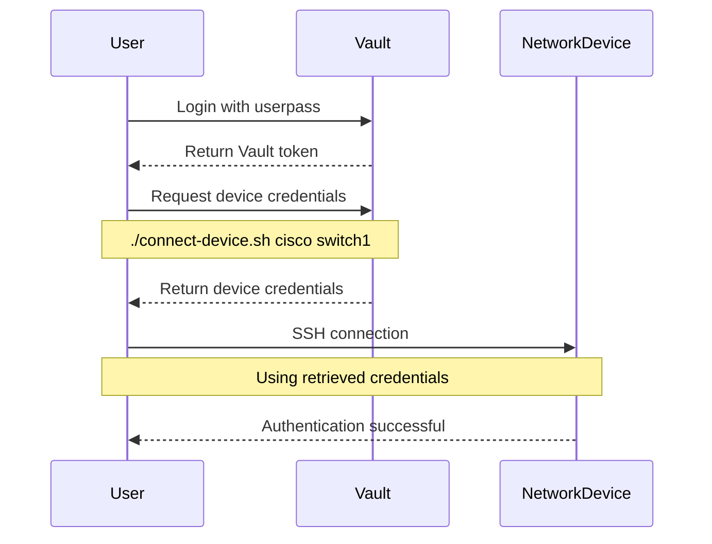
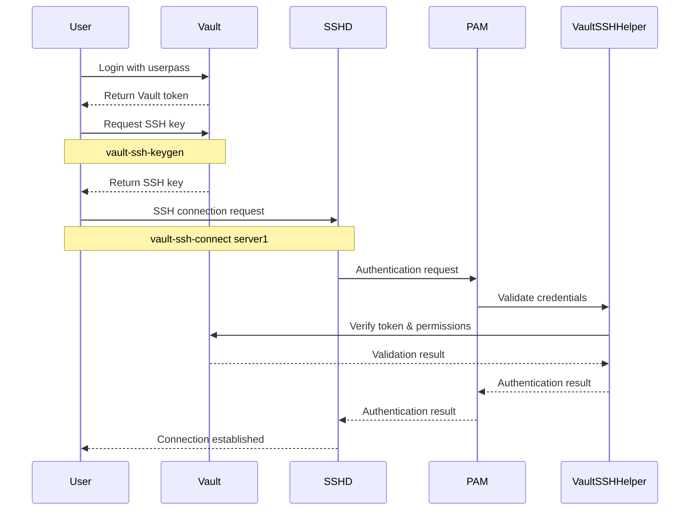

# Privileged Access Management (PAM) System

A comprehensive Privileged Access Management system built with HashiCorp Vault and etcd, designed to securely manage access to network devices and systems.

## Features

- **HashiCorp Vault Integration**
  - Secure secrets management
  - Dynamic credential generation
  - Access control policies
  - Audit logging

- **High Availability Storage**
  - 3-node etcd cluster
  - Consensus-based replication
  - Automatic failover
  - Data persistence

- **Docker-based Deployment**
  - Containerized services
  - Easy deployment
  - Consistent environments
  - Scalable architecture

- **Network Device Management**
  - Support for Cisco devices
  - Support for Palo Alto Networks devices
  - Secure credential storage
  - Automated device connections
  - Role-based access control

- **SSH Authentication**
  - Secure SSH key management
  - Dynamic credential generation
  - Access control policies
  - Audit logging

- **Automated Setup**
  - One-command initialization
  - Automated unsealing
  - Configuration management
  - Health checks

## Prerequisites

- Docker and Docker Compose
- OpenSSL (for certificate generation)
- `sshpass` and `jq` (for network device management)
- Network access to target devices

## Quick Start

1. Clone the repository:
   ```bash
   git clone https://github.com/yourusername/vault-pam.git
   cd vault-pam
   ```

2. Initialize the system:
   ```bash
   ./init-vault.sh
   ```

3. Source the aliases:
   ```bash
   source vault-aliases.sh
   ```

4. Set up SSH authentication:
   ```bash
   ./setup-ssh-auth.sh
   ```

5. Set up network device management:
   ```bash
   ./network-device-setup.sh
   ```

## Login Process

### Vault Login

1. **Initial Login**
   After initialization, you'll need to log in to Vault:
   ```bash
   # Login with the root token (first time only)
   vault login <root-token>
   
   # Or use the alias
   vault-login
   ```

2. **User Login**
   For regular users:
   ```bash
   # Login as a network admin
   vault login -method=userpass username=network-admin
   # Enter password when prompted
   
   # Login as a device admin
   vault login -method=userpass username=device-admin
   # Enter password when prompted
   ```

### Network Device Access

1. **Cisco Device Login**
   ```bash
   # Connect to a Cisco device
   ./connect-device.sh cisco switch1
   # The script will automatically:
   # 1. Retrieve credentials from Vault
   # 2. Establish SSH connection
   # 3. Log you in to the device
   ```

2. **Palo Alto Device Login**
   ```bash
   # Connect to a Palo Alto device
   ./connect-device.sh paloalto fw1
   # The script will automatically:
   # 1. Retrieve credentials from Vault
   # 2. Establish SSH connection
   # 3. Log you in to the device
   ```

### SSH Authentication

1. **Generate and Store SSH Key**
   ```bash
   # Generate a new SSH key
   vault-ssh-keygen
   
   # Add the key to Vault
   vault-ssh-add
   ```

2. **Connect to Systems**
   ```bash
   # Connect to a Linux system
   vault-ssh-connect server1
   # The script will:
   # 1. Retrieve your SSH key from Vault
   # 2. Establish SSH connection
   # 3. Log you in to the system
   ```

### Session Management

1. **Check Current Session**
   ```bash
   # View current Vault token and policies
   vault token lookup
   
   # List active sessions
   vault list auth/token/accessors
   ```

2. **Logout**
   ```bash
   # Logout from Vault
   vault logout
   
   # Or use the alias
   vault-logout
   ```

## Architecture

```
┌─────────────┐     ┌─────────────┐     ┌─────────────┐
│   Vault 1   │     │   Vault 2   │     │   Vault 3   │
└──────┬──────┘     └──────┬──────┘     └──────┬──────┘
       │                   │                   │
       └───────────┬───────┴───────────┬───────┘
                   │                   │
            ┌──────┴──────┐    ┌──────┴──────┐
            │   etcd 1    │    │   etcd 2    │
            └──────┬──────┘    └──────┬──────┘
                   │                   │
            ┌──────┴──────┐    ┌──────┴──────┐
            │   etcd 3    │    │  Network    │
            └─────────────┘    │  Devices    │
                               └─────────────┘
```

## Authentication Flow

### Network Device Authentication



### SSH Authentication with PAM



## Components

### Vault Configuration
- High availability setup
- TLS encryption
- Audit logging
- Access policies

### etcd Cluster
- 3-node consensus
- Data persistence
- Automatic failover
- Health monitoring

### Network Device Management
- Support for multiple device types
- Secure credential storage
- Automated connections
- Access control policies

## Usage

### Basic Vault Operations

1. Check Vault status:
   ```bash
   vault-status
   ```

2. Unseal Vault:
   ```bash
   vault-unseal
   ```

3. Login to Vault:
   ```bash
   vault-login
   ```

### Network Device Management

1. Add a new device:
   ```bash
   # Add a Cisco device
   ./manage-devices.sh add cisco switch1 admin password123

   # Add a Palo Alto device
   ./manage-devices.sh add paloalto fw1 admin password123
   ```

2. List devices:
   ```bash
   # List Cisco devices
   ./manage-devices.sh list cisco

   # List Palo Alto devices
   ./manage-devices.sh list paloalto
   ```

3. Connect to devices:
   ```bash
   # Connect to a Cisco device
   ./connect-device.sh cisco switch1

   # Connect to a Palo Alto device
   ./connect-device.sh paloalto fw1
   ```

4. Update device credentials:
   ```bash
   ./manage-devices.sh update <device-type> <device-name> <username> <password>
   ```

5. Delete a device:
   ```bash
   ./manage-devices.sh delete <device-type> <device-name>
   ```

### SSH Authentication

1. Generate SSH key:
   ```bash
   vault-ssh-keygen
   ```

2. Add SSH key to Vault:
   ```bash
   vault-ssh-add
   ```

3. Connect to a system:
   ```bash
   vault-ssh-connect <system-name>
   ```

## Security Considerations

1. **Production Deployment**
   - Enable TLS for all communications
   - Use proper authentication methods
   - Set up audit logging
   - Configure proper access policies
   - Restrict network access
   - Regularly rotate credentials

2. **Network Device Security**
   - Change default passwords
   - Use strong authentication
   - Implement access controls
   - Monitor device access
   - Regular credential rotation

3. **Best Practices**
   - Regular backups
   - Monitoring and alerting
   - Access review
   - Security audits
   - Compliance checks

## Maintenance

1. **Regular Tasks**
   - Monitor system health
   - Review audit logs
   - Rotate credentials
   - Update configurations
   - Backup data

2. **Troubleshooting**
   - Check service status
   - Review logs
   - Verify connectivity
   - Test authentication
   - Validate policies

## Troubleshooting

1. **Common Issues**
   - Vault unsealing problems
   - Authentication failures
   - Connection issues
   - Policy conflicts
   - Storage errors

2. **Solutions**
   - Check service status
   - Verify configurations
   - Review logs
   - Test connectivity
   - Validate policies

## Contributing

1. Fork the repository
2. Create a feature branch
3. Commit your changes
4. Push to the branch
5. Create a Pull Request

## License

This project is licensed under the MIT License - see the [LICENSE](LICENSE) file for details.

## Acknowledgments

- HashiCorp Vault
- etcd
- Docker
- OpenSSH 